# AIDD Execution Flow Diagram

```mermaid
graph TD
    A[Start aidd.sh] --> B[Parse Command Line Arguments]
    B --> C[Check Required Arguments]
    C --> D{Project Dir Provided?}
    D -->|No| E[Show Error & Exit]
    D -->|Yes| F[Get Script Directory]

    F --> G[Resolve Effective Models]
    G --> H[Build Model Args]
    H --> H1[Determine CLI: OpenCode or KiloCode]

    H1 --> I[Check if Existing Codebase]
    I --> J{Dir Exists & Has Non-Ignored Files?}
    J -->|No| K[Set NEEDS_SPEC=true]
    J -->|Yes| L[Set NEEDS_SPEC=false]

    K --> M{NEEDS_SPEC && Spec Provided?}
    L --> M
    M -->|No and NEEDS_SPEC| N[Show Error & Exit]
    M -->|Yes/Not Needed| O[Ensure Project Directory Exists]

    O --> P{Project Dir Exists?}
    P -->|No| Q[Create Project Directory]
    Q --> R[Copy Scaffolding Files]
    R --> S[Copy Artifacts to .automaker]
    S --> T[Mark NEW_PROJECT_CREATED=true]
    P -->|Yes| U[Print Existing Codebase Detected]

    T --> V[If Spec File Provided, Validate It Exists]
    U --> V
    V --> W[Define Paths: .automaker/app_spec.txt, features/, iterations/]
    W --> X[Create Iterations Directory]
    X --> Y[Get Next Log Index]
    Y --> Z[Init Failure Counter]
    Z --> AA[Set Cleanup Trap unless --no-clean]

    AA --> AB{Max Iterations Set?}
    AB -->|No| AC[Run Unlimited Iterations]
    AB -->|Yes| AD[Run Limited Iterations]

    AC --> AE[Iteration Loop Start]
    AD --> AE
    AE --> AE1[Sync Shared Directories from copydirs.txt]
    AE1 --> AF[Create Log File]
    AF --> AG[Start Logging via tee/coprocess]
    AG --> AH[Compute ONBOARDING_COMPLETE]
    AH --> AI{Have spec+feature_list AND onboarding complete?}

    AI -->|Yes| AJ[Send Coding Prompt]
    AI -->|No| AK{Existing Codebase AND not NEW_PROJECT_CREATED?}

    AK -->|Yes| AL[Copy Artifacts no overwrite]
    AL --> AM[Send Onboarding Prompt]

    AK -->|No| AN[Copy Artifacts no overwrite]
    AN --> AO[If Spec Provided, Copy to .automaker/app_spec.txt]
    AO --> AP[Send Initializer Prompt]

    AJ --> AQ[run_cli_prompt via coprocess]
    AM --> AQ
    AP --> AQ

    AQ --> AR[Monitor Output with Idle Detection]
    AR --> AS{Idle for nudge-timeout seconds?}
    AS -->|Yes| AT[Send 'Are you stuck?' message]
    AT --> AU{Still idle for remaining timeout?}
    AU -->|Yes| AV[Kill process - Idle Timeout]
    AS -->|No| AW{CLI exit code?}
    AU -->|No| AW

    AW -->|0| AX[Reset Failure Counter]
    AW -->|71 Idle| AY[Increment Failure Counter]
    AW -->|Other Non-Zero| AY

    AY --> AZ{Failure Threshold Reached?}
    AZ -->|Yes| BA[Exit With Failure]
    AZ -->|No| BB[Continue Next Iteration]

    AX --> BB
    BB --> BC{More Iterations?}
    BC -->|Yes| AE
    BC -->|No| BD[Exit cleanup trap runs]

    style A fill:#e1f5fe
    style E fill:#ffebee
    style N fill:#ffebee
    style AV fill:#fff3e0
    style BA fill:#ffebee
    style BD fill:#e8f5e9
    style AT fill:#fff9c4
```

## Key Decision Points

### 1. CLI Selection

- **OpenCode** (default): `opencode run`
- **KiloCode**: Specify with `--cli kilocode`

### 2. Project Directory Check

Determines if we're working with an existing codebase or creating a new project.

### 3. Spec Requirement

- **New projects**: Require `--spec` argument
- **Existing projects**: Spec generated during onboarding

### 4. Iteration Mode

Can run unlimited iterations or a specific number via `--max-iterations`.

### 5. Shared Directory Sync (v2.1.0+)

At the start of each iteration, syncs directories listed in `copydirs.txt`:

- IDE configurations (`.claude`, `.windsurf`, `.vscode`)
- Shared linting rules
- Common templates

### 6. Two-Stage Idle Timeout (v2.1.0+)

When agent becomes unresponsive:

- **Stage 1** (default 180s): Send nudge message asking if agent is stuck
- **Stage 2** (remaining time): Hard kill if still no response
- Total timeout controlled by `--idle-timeout` (default 360s)

### 7. Onboarding Completion

Onboarding is complete when ALL of these exist in `.automaker/`:

- `features/` directory with at least one `feature.json`
- `app_spec.txt` spec file
- `CHANGELOG.md`

### 8. Prompt Selection

Based on project state:

- **Onboarding**: Existing codebases when `.automaker` files missing/incomplete
- **Initializer**: New/empty projects where spec is copied
- **Coding**: When spec and feature_list exist and onboarding complete
- **TODO**: When `--todo` flag is used (work on todo items)

### 9. Abort/Failure Policy

`--quit-on-abort N` stops after N consecutive failures.

## File Operations

### Scaffolding Copy

Only for new projects - copies template structure.

### Artifacts Copy

Copies metadata templates into `.automaker/` without overwriting existing files:

- `features/` directory structure
- `progress.md` template
- `project_structure.md` template
- `todo.md` template

### Spec Copy

If `--spec` provided, copied to `.automaker/app_spec.txt` during initializer flow.

### Log Management

- Automatic cleanup on exit unless `--no-clean` is set
- Logs stored in `.automaker/iterations/NNN.log`
- Sequential numbering prevents overwrites

### Shared Directory Sync

- Reads `copydirs.txt` for directory paths
- Uses `rsync -av --delete` (falls back to `cp -R`)
- Runs at start of each iteration

## Error Handling

### Exit Codes

- **0**: Success
- **1**: General error
- **2**: Invalid arguments
- **70**: No assistant messages detected
- **71**: Idle timeout
- **72**: Provider error
- **124**: Signal terminated

### Early Abort Conditions

- Missing required arguments → immediate exit
- Spec file not found when provided → immediate exit
- No assistant messages → exit code 70
- Provider errors → exit code 72
- Idle timeout → exit code 71 (after nudge attempt)

### Cleanup

Trap ensures logs are cleaned on exit even on interruption (unless `--no-clean`).

## Prompt Architecture (v2.0+)

All prompts follow modular structure with shared `_common/` modules:

### Common Modules

- `assistant-rules-loading.md` - Load project-specific rules
- `project-overrides.md` - Handle project.txt overrides
- `testing-requirements.md` - UI testing guidelines
- `file-integrity.md` - Safe file editing protocols
- `hard-constraints.md` - Non-negotiable constraints
- `tool-selection-guide.md` - Tool selection hierarchy
- `error-handling-patterns.md` - Error recovery strategies

### Workflow Steps (All Prompts)

1. **Step 0**: Ingest assistant rules (highest priority)
2. **Step 1**: Check project overrides
3. **Step 2+**: Prompt-specific workflow

This modular approach:

- Reduces token usage by 25-30%
- Ensures consistency across prompts
- Simplifies maintenance
- Prevents drift

## CLI Abstraction

Uses factory pattern to support multiple CLIs:

- `cli-factory.sh` - Unified interface
- `opencode-cli.sh` - OpenCode implementation
- `kilocode-cli.sh` - KiloCode implementation

Same codebase supports both CLIs with minimal differences.
