# AIDD Execution Flow Diagram

```mermaid
graph TD
    A[Start aidd.sh] --> B[Parse Command Line Arguments]
    B --> C[Check Required Arguments]
    C --> D{Project Dir Provided?}
    D -->|No| E[Show Error & Exit]
    D -->|Yes| F[Get Script Directory]

    F --> G[Resolve Effective Models]
    G --> H[Build Model Args]
    H --> H1[Determine CLI: OpenCode or KiloCode]

    H1 --> H2{Audit Mode?}
    H2 -->|Yes| H3[Multi-Audit Loop]
    H3 --> H4[Set Current Audit Name]
    H4 --> I
    H2 -->|No| I[Check if Existing Codebase]
    I --> J{Dir Exists & Has Non-Ignored Files?}
    J -->|No| K[Set NEEDS_SPEC=true]
    J -->|Yes| L[Set NEEDS_SPEC=false]

    K --> M{NEEDS_SPEC && Spec Provided?}
    L --> M
    M -->|No and NEEDS_SPEC| N[Show Error & Exit]
    M -->|Yes/Not Needed| O[Ensure Project Directory Exists]

    O --> P{Project Dir Exists?}
    P -->|No| Q[Create Project Directory]
    Q --> R[Copy Scaffolding Files]
    R --> S[Copy Artifacts to .automaker]
    S --> T[Mark NEW_PROJECT_CREATED=true]
    P -->|Yes| U[Print Existing Codebase Detected]

    T --> V[If Spec File Provided, Validate It Exists]
    U --> V
    V --> W[Define Paths: .automaker/app_spec.txt, features/, iterations/]
    W --> X[Create Iterations Directory]
    X --> Y[Get Next Log Index]
    Y --> Z[Init Failure Counter]
    Z --> AA[Set Cleanup Trap unless --no-clean]

    AA --> AB{Max Iterations Set?}
    AB -->|No| AC[Run Unlimited Iterations]
    AB -->|Yes| AD[Run Limited Iterations]

    AC --> AE[Iteration Loop Start]
    AD --> AE
    AE --> AE1[Sync Shared Directories from copydirs.txt]
    AE1 --> AE2[Sync Shared Files from copyfiles.txt]
    AE2 --> AF[Create Log File]
    AF --> AG[Start Logging via tee/coprocess]
    AG --> AH[Compute ONBOARDING_COMPLETE]
    AH --> AI{Have spec+feature_list AND onboarding complete?}

    AI -->|Yes| AI2{Custom Prompt?}
    AI2 -->|Yes| AI2a[Send Custom Prompt]
    AI2 -->|No| AI3{Audit Mode?}
    AI3 -->|Yes| AI3a[Send Audit Prompt]
    AI3 -->|No| AI4{Completion Pending OR --todo?}
    AI4 -->|Yes| AI4a[Send TODO Prompt]
    AI4 -->|No| AI5{--validate?}
    AI5 -->|Yes| AI5a[Send Validate Prompt]
    AI5 -->|No| AI6{--in-progress?}
    AI6 -->|Yes| AI6a[Send In-Progress Prompt]
    AI6 -->|No| AJ[Send Coding Prompt]
    AI -->|No| AK{Existing Codebase AND not NEW_PROJECT_CREATED?}

    AK -->|Yes| AL[Copy Artifacts no overwrite]
    AL --> AM[Send Onboarding Prompt]

    AK -->|No| AN[Copy Artifacts no overwrite]
    AN --> AO[If Spec Provided, Copy to .automaker/app_spec.txt]
    AO --> AP[Send Initializer Prompt]

    AI2a --> AQ[run_cli_prompt via coprocess]
    AI3a --> AQ
    AI4a --> AQ
    AI5a --> AQ
    AI6a --> AQ
    AJ --> AQ
    AM --> AQ
    AP --> AQ

    AQ --> AR[Monitor Output with Idle Detection]
    AR --> AS{Idle for nudge-timeout seconds?}
    AS -->|Yes| AT[Send 'Are you stuck?' message]
    AT --> AU{Still idle for remaining timeout?}
    AU -->|Yes| AV[Kill process - Idle Timeout]
    AS -->|No| AW{CLI exit code?}
    AU -->|No| AW

    AW -->|0| AX[Reset Failure Counter]
    AW -->|71 Idle| AY[Increment Failure Counter]
    AW -->|Other Non-Zero| AY

    AY --> AZ{Failure Threshold Reached?}
    AZ -->|Yes| BA[Exit With Failure]
    AZ -->|No| BB[Continue Next Iteration]

    AX --> BB
    BB --> BC{More Iterations?}
    BC -->|Yes| AE
    BC -->|No| BD[Exit cleanup trap runs]

    style A fill:#e1f5fe
    style E fill:#ffebee
    style N fill:#ffebee
    style AV fill:#fff3e0
    style BA fill:#ffebee
    style BD fill:#e8f5e9
    style AT fill:#fff9c4
    style AE1 fill:#e3f2fd
    style AE2 fill:#e3f2fd
    style H3 fill:#f3e5f5
    style AI3a fill:#f3e5f5
    style AI4a fill:#e8eaf6
    style AI5a fill:#e8eaf6
    style AI6a fill:#e8eaf6
```



## Key Decision Points

### 1. CLI Selection

- **OpenCode** (default): `opencode run`
- **KiloCode**: Specify with `--cli kilocode`
- **Claude Code**: Specify with `--cli claude-code`

### 2. Project Directory Check

Determines if we're working with an existing codebase or creating a new project.

### 3. Spec Requirement

- **New projects**: Require `--spec` argument
- **Existing projects**: Spec generated during onboarding

### 4. Iteration Mode

Can run unlimited iterations or a specific number via `--max-iterations`.

### 5. Shared Resource Sync

At the start of each iteration, syncs resources from config files:

**Directories** (`copydirs.txt`):

- IDE configurations (`.claude`, `.windsurf`, `.vscode`)
- Shared linting rules
- Common templates

**Files** (`copyfiles.txt`):

- Individual config files (`.prettierrc`, `.editorconfig`)
- License files
- Supports custom target paths via `source -> target` syntax

### 6. Two-Stage Idle Timeout

When agent becomes unresponsive:

- **Stage 1** (default 300s): Send nudge message asking if agent is stuck
- **Stage 2** (remaining time): Hard kill if still no response
- Total timeout controlled by `--idle-timeout` (default 900s)

### 7. Onboarding Completion

Onboarding is complete when ALL of these exist in `.automaker/`:

- `features/` directory with at least one `feature.json`
- `app_spec.txt` spec file
- `CHANGELOG.md`

### 8. Prompt Selection

Based on project state (priority cascade):

- **Custom**: When `--prompt` flag provides a user-supplied prompt
- **Audit**: When `--audit AUDIT_NAME` is used (specialized code audits)
- **TODO**: When completion is pending OR `--todo` flag is used (work on todo items)
- **Validate**: When `--validate` flag is used (verify incomplete features/todos)
- **In-Progress**: When `--in-progress` flag is used (continue in-progress features)
- **Coding**: When spec and feature_list exist and onboarding complete
- **Onboarding**: Existing codebases when `.automaker` files missing/incomplete
- **Initializer**: New/empty projects where spec is copied

### 9. Audit Mode (v2.3.0+)

Run specialized code audits that generate actionable issue backlogs:

- **Single Audit**: `--audit SECURITY`
- **Multi-Audit**: `--audit SECURITY,CODE_QUALITY,ARCHITECTURE` (comma-separated)
- **Sequential Execution**: Each audit runs independently with its own iterations
- **Issue Generation**: Creates `feature.json` files in `.automaker/features/audit-{name}-*/`
- **Audit Reports**: Generates reports in `.automaker/audit-reports/`
- **Cross-References**: Referenced audit files copied to `.automaker/audits/`

### 10. Abort/Failure Policy

`--quit-on-abort N` stops after N consecutive failures.

## File Operations

### Scaffolding Copy

Only for new projects - copies template structure.

### Artifacts Copy

Copies metadata templates into `.automaker/` without overwriting existing files:

- `features/` directory structure
- `CHANGELOG.md` template
- `project_structure.md` template
- `todo.md` template

### Spec Copy

If `--spec` provided, copied to `.automaker/app_spec.txt` during initializer flow.

### Log Management

- Automatic cleanup on exit unless `--no-clean` is set
- Logs stored in `.automaker/iterations/NNN.log`
- Sequential numbering prevents overwrites

### Shared Resource Sync

**Directories** (`copydirs.txt`):

- Reads directory paths (one per line)
- Uses `rsync -av --delete` (falls back to `cp -R`)
- Runs at start of each iteration

**Files** (`copyfiles.txt`):

- Reads file paths (one per line)
- Simple format: `<source>` copies to project root
- Custom target: `<source> -> <target>` for specific paths
- Creates target directories as needed
- Runs after directory sync

## Error Handling

### Exit Codes

- **0**: Success
- **1**: General error
- **2**: Invalid arguments
- **3**: File or resource not found
- **4**: Permission denied
- **5**: Timeout occurred
- **6**: Aborted (user requested stop via `.stop` file)
- **7**: Validation failed
- **8**: CLI error
- **70**: No assistant messages detected
- **71**: Idle timeout
- **72**: Provider error
- **73**: Project complete (all features pass, no TODOs)
- **74**: Rate limited (API rate limit hit, pause and retry)
- **124**: Signal terminated

### Early Abort Conditions

- Missing required arguments → immediate exit
- Spec file not found when provided → immediate exit
- No assistant messages → exit code 70
- Provider errors → exit code 72
- Idle timeout → exit code 71 (after nudge attempt)
- Project already completed (`.project_completed` exists) → exit code 73
- User stop signal (`.stop` file exists) → exit code 6

### Project Completion Detection

Two-phase detection prevents false positives:

1. **Phase 1**: All features pass + no actionable TODOs → creates `.project_completion_pending`, runs TODO review
2. **Phase 2**: Still complete after review → creates `.project_completed` marker, exits with code 73

The `.project_completed` marker prevents restart loops. Delete it to restart a completed project.

**TODO syntax for completion detection:**

| Syntax  | Meaning                                            | Blocks completion? |
| ------- | -------------------------------------------------- | ------------------ |
| `- [ ]` | Incomplete (actionable)                            | Yes                |
| `- [x]` | Completed                                          | No                 |
| `- [~]` | Deferred (requires manual/external action)         | No                 |
| `- [!]` | Deferred (acknowledged blocker, not AI-resolvable) | No                 |

Use `- [~]` or `- [!]` for TODOs the AI agent cannot resolve (e.g., "requires manual update", "needs human review"). These are displayed in status output but do not prevent project completion.

**Marker preservation:** Completion markers are only deleted when features are actually failing. If all features pass but actionable TODOs remain, markers are preserved so completion triggers immediately when TODOs are resolved or deferred.

**Stuck detection:** Git change detection excludes `.automaker/` metadata files. Formatting drift on auto-generated files (e.g., `status.md`) does not count as meaningful change and will not reset the stuck counter.

### Graceful Shutdown

Create `.automaker/.stop` to signal AIDD to stop after current iteration:

```bash
./aidd.sh --project-dir ./myproject --stop
# Or: touch ./myproject/.automaker/.stop
```

Stale `.stop` files are automatically cleaned up on startup.

### Cleanup

Trap ensures logs are cleaned on exit even on interruption (unless `--no-clean`).

## Prompt Architecture (v2.0+)

All prompts follow modular structure with shared `_common/` modules:

### Common Modules

- `assistant-rules-loading.md` - Load project-specific rules
- `project-overrides.md` - Handle project.md overrides
- `testing-requirements.md` - UI testing guidelines
- `file-integrity.md` - Safe file editing protocols
- `hard-constraints.md` - Non-negotiable constraints
- `tool-selection-guide.md` - Tool selection hierarchy
- `error-handling-patterns.md` - Error recovery strategies

### Workflow Steps (All Prompts)

1. **Step 0**: Ingest assistant rules (highest priority)
2. **Step 1**: Check project overrides
3. **Step 2+**: Prompt-specific workflow

This modular approach:

- Reduces token usage by 25-30%
- Ensures consistency across prompts
- Simplifies maintenance
- Prevents drift

## CLI Abstraction

Uses factory pattern to support multiple CLIs:

- `cli-factory.sh` - Unified interface
- `cli-opencode.sh` - OpenCode implementation
- `cli-kilocode.sh` - KiloCode implementation
- `cli-claude-code.sh` - Claude Code implementation

Same codebase supports all three CLIs with minimal differences.
